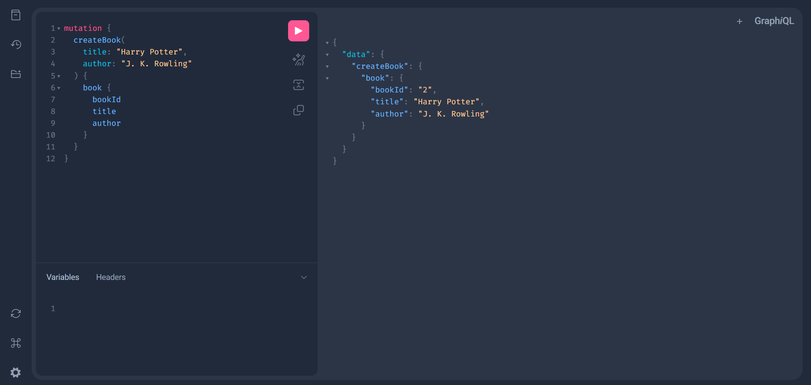
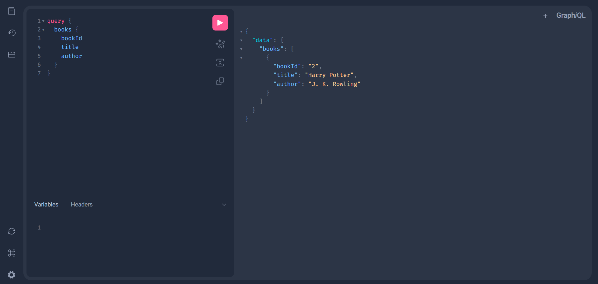
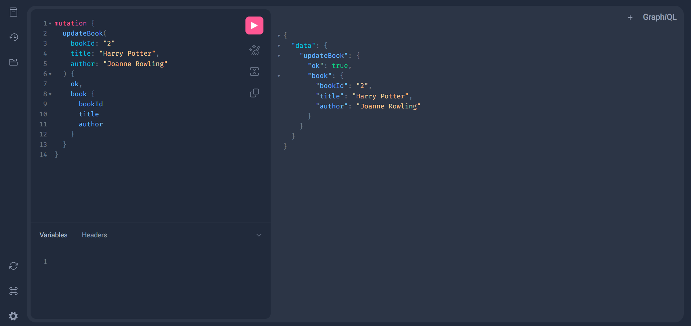
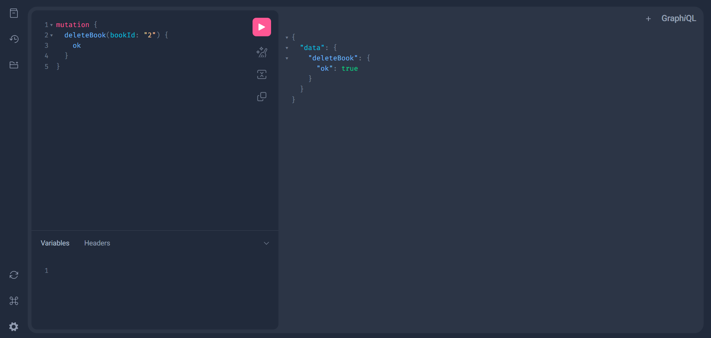

<h1 align="center">GraphQL Learning App</h1>
We've all heard of REST API's, they allow you to define verbs like GET, POST, DELETE and PUT that are linked to endpoints. These endpoitns carry out actions over some data, but how many endpoints do you need to define for your API to have a design that fits your requirements. Do you also need all the data returned from an API endpoint everytime you send a request to it ? And how about the constant need to maintain and do changes to your API design to fit requirements.
What if instead of defining endpoints, you just had one endpoint, you send a customized query to that endpoint, and it will do exactly what you ask it for, nothing more or less. This is where GraphQL comes in. It's simply a query language for an API, the way it workd is that you would describe how your data looks like in something called a schema. You would then send a query to the GraphQL API specifying exactly what fields you're looking for and the response will have exactly the data you've requested.

To implement a GraphQL API in Python we use Python-specific libraries to describe a schema and its elements using Python code.
There are several wide GraphQL Python modules but the most widely used include Graphene and Strawberry.

To implement GraphQL in Django, we use more specific extensions of those Python libraries, the most common being Graphene Django, Strawberry Django, and Strawberry Django Plus. Strawberry Django Plus is built on top of the Strawberry Django integration. One difference between something like Graphene and Django Graphene is that while Graphene offers an object-type class, Django Graphene offers the Django object-type class more geared towards Django-specific use cases, like making a connection between the model we define for an app in models.py and the oject types in the GraphQL schema.

Teams wanting to implement a GraphQL API usually compare the most popular GraphQL libraries to decide which one to adopt for their project. Comparisons can be done at both the Python library and the Django extension level. Some metrics that are commonly considered include release cadence, how often there's a new release on their GitHub repo, stars, the amount of stars that each repo has, issues, the amount of issues that are currently open. 
Another difference between the two libraries is the syntax used when defining the GraphQL schema types, queries, and other components, with Strawberry leveraging Python type hints and Graphene having a syntax very similar to Django models.

This is a small app I built while learning Graphene Django 🔥. I'm excited to dive deeper into GraphQL and explore its potential. It's been a rewarding learning experience so far, and I look forward to expanding my knowledge and building more projects with it! 😊

Feel free to customize it further based on your experience! 😊
